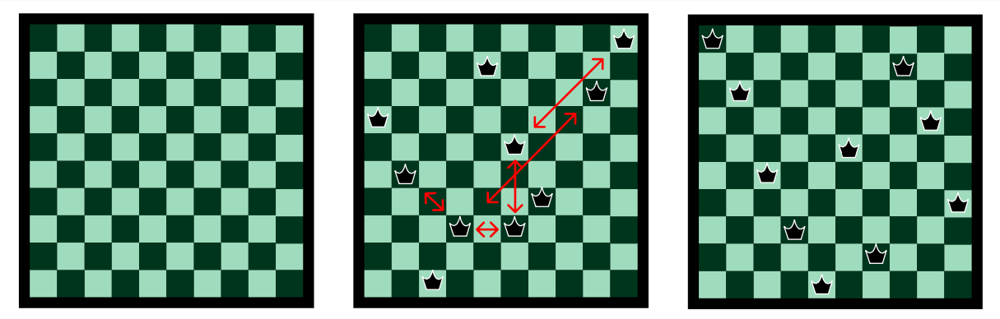

# 4 different algorithms for solving the N-queens problem
## A comparative study on using GA, SA, Hill climbing and DFS to solving the N-queens problem for n <= 200.

The N-queens problem is a known problem, often used in machine learning, that requires placing n queens on an n×n chessboard such that no two queens attack each other. As the problem scales, traditional exhaustive approaches become computationally expensive, making it a useful benchmark for evaluating optimisation strategies.

Below is an example of a 10-queens problem. In the left image, the board is empty. In the center image a false solution is shown, and the queens that are attacking each other are marked. In the right image a solution is shown that was found using the Hill Climbing algorithm.
  

The full Overleaf report can be found here: https://www.overleaf.com/read/bknggfkfnqfm#9981ea
